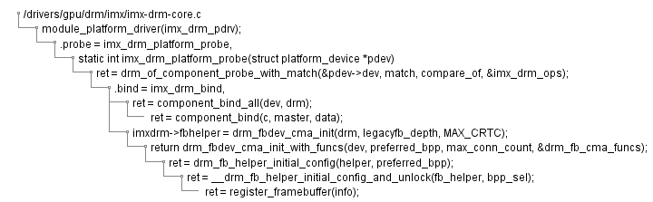

# README

* M2PlantT: Markdown List To PlantUML Tree
* [**Visual Studio Code Plugin**](https://marketplace.visualstudio.com/items?itemName=okazuki.okazukiplantuml)
* [PlantUML Online](http://www.plantuml.com/plantuml/uml/SyfFKj2rKt3CoKnELR1Io4ZDoSa70000)

## 参考文档

* [有哪些现代一点、好看点的 UML 图绘制工具？](https://www.zhihu.com/question/20144020)
* [PlantUML](http://plantuml.com/zh/index)
* [salt](http://plantuml.com/zh/salt)

## 依赖

* Python3
* Java

## 使用说明

* 如[mkList.txt](mkList.txt)中放入Markdown List数据；
* 运行[M2PlantT.py](M2PlantT.py)，输出png文件：
  
* 或者svg文件：
  